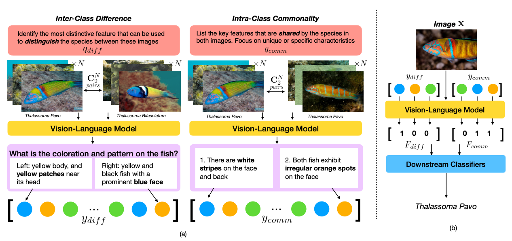

# Verbalized Representation Learning (VRL)

**Verbalized Representation Learning for Interpretable Few-Shot Generalization** 

🏆 Accepted to ICCV 2025

📣 [](https://arxiv.org/abs/2411.18651)


## 🎬 Author
[Cheng-Fu Yang](https://joeyy5588.github.io/chengfu-yang/), [Da Yin](https://wadeyin9712.github.io/), [Wenbo Hu](https://gordonhu608.github.io/), Heng Ji, Nanyun Peng, Bolei Zhou, Kai-Wei Chang



## 🔍 Overview

This repository contains code and instructions for our paper on **Verbalized Representation Learning**, which leverages human-like verbal descriptions to enhance few-shot generalization in vision models.

## 🚀 Installation
```bash
pip install --upgrade pip
pip install "sglang[all]"

# Install FlashInfer accelerated kernels (CUDA only for now)
pip install flashinfer -i https://flashinfer.ai/whl/cu121/torch2.4/
pip install tabulate open-clip-torch
```

## 📂 Dataset
Download the iNaturalist dataset from [here](https://github.com/visipedia/inat_comp/tree/master/2021)

Download the Kiki-Bouba datasets here:

KikiBouba_v1: [link](https://drive.google.com/file/d/1-a4FRS9N1DLf3_YIYq8150zN1uilapft/view?usp=sharing)

KikiBouba_v2: [link](https://drive.google.com/file/d/17ibF3tzFiZrMb9ZnpYlLEh-xmWkPJpNH/view?usp=sharing)

You will need to subsample the dataset to create the few-shot setting.
```bash
# TBD: Script to subsample the dataset
```

## ⚙️ Training
Launch the LLaVA model in backend:
```bash
python -m sglang.launch_server --model-path lmms-lab/llava-onevision-qwen2-7b-ov --port=30000 --chat-template=chatml-llava --tp-size 2
```

For inter-class difference features:
```bash
# For iNaturalist
cd inat
# For kiki-bouba
cd kiki
python 1_generate_criteria.py --answer-file-folder YOUR_ANSWER_FILE_FOLDER --image-folder TRAIN_IMAGE_FOLDER
python 2_convert_criteria_caption.py --explanation-folder YOUR_ANSWER_FILE_FOLDER_IN_1 --answer-file-folder YOUR_ANSWER_FILE_FOLDER
# for llava feature mapping
python 3_generate_feature_ov.py --image-folder TRAIN_IMAGE_FOLDER --question-file-folder YOUR_ANSWER_FILE_FOLDER_IN_2 --answer-file-folder YOUR_ANSWER_FILE_FOLDER
# for clip feature mapping
python 3_generate_feature_clip.py --image-folder TRAIN_IMAGE_FOLDER --question-file-folder YOUR_ANSWER_FILE_FOLDER_IN_2 --answer-file-folder YOUR_ANSWER_FILE_FOLDER
```
For intra-class commonality features:
```bash
# For iNaturalist
cd inat
# For kiki-bouba
cd kiki
python a_generate_criteria_same.py --answer-file-folder YOUR_ANSWER_FILE_FOLDER --image-folder TRAIN_IMAGE_FOLDER
python b_convert_criteria_caption.py --explanation-folder YOUR_ANSWER_FILE_FOLDER_IN_A --answer-file-folder YOUR_ANSWER_FILE_FOLDER
# for llava feature mapping
python c_generate_feature_ov.py --image-folder TRAIN_IMAGE_FOLDER --question-file-folder YOUR_ANSWER_FILE_FOLDER_IN_B --answer-file-folder YOUR_ANSWER_FILE_FOLDER
# for clip feature mapping
python c_generate_feature_clip.py --image-folder TRAIN_IMAGE_FOLDER --question-file-folder YOUR_ANSWER_FILE_FOLDER_IN_B --answer-file-folder YOUR_ANSWER_FILE_FOLDER
```

## 🧪 Evaluation
For inter-class difference features:
```bash
# For iNaturalist
cd inat
# For kiki-bouba
cd kiki

# for llava feature mapping
python 3_generate_feature_ov.py --image-folder TEST_IMAGE_FOLDER --question-file-folder YOUR_ANSWER_FILE_FOLDER_IN_2_TRAINING --answer-file-folder YOUR_ANSWER_FILE_FOLDER
# for clip feature mapping
python 3_generate_feature_clip.py --image-folder TEST_IMAGE_FOLDER --question-file-folder YOUR_ANSWER_FILE_FOLDER_IN_2_TRAINING --answer-file-folder YOUR_ANSWER_FILE_FOLDER
# Evaluate 
python evaluate.py --training-feature-file YOUR_TRAINING_FEATURE_FILE --inference-feature-file YOUR_TESTING_FEATURE_FILE --result-file YOUR_RESULT_FILE --result-folder YOUR_RESULT_FOLDER
```

For intra-class commonality features:
```bash
# For iNaturalist
cd inat
# For kiki-bouba
cd kiki

# for llava feature mapping
python c_generate_feature_ov.py --image-folder TEST_IMAGE_FOLDER --question-file-folder YOUR_ANSWER_FILE_FOLDER_IN_B_TRAINING --answer-file-folder YOUR_ANSWER_FILE_FOLDER
# for clip feature mapping
python c_generate_feature_clip.py --image-folder TEST_IMAGE_FOLDER --question-file-folder YOUR_ANSWER_FILE_FOLDER_IN_B_TRAINING --answer-file-folder YOUR_ANSWER_FILE_FOLDER
# Evaluate 
python evaluate.py --training-feature-file YOUR_TRAINING_FEATURE_FILE --inference-feature-file YOUR_TESTING_FEATURE_FILE --result-file YOUR_RESULT_FILE --result-folder YOUR_RESULT_FOLDER
```

For the feature ensemble experiment:
```bash
# Assuming that you have already generated the features for the inter-class difference and intra-class commonality features
python ensemble.py --question-file-folder YOUR_QUESTION_FILE_FOLDER --train-feature-folder-1 YOUR_TRAINING_FEATURE_FOLDER_1 --val-feature-folder-1 YOUR_TESTING_FEATURE_FOLDER_1 --train-feature-folder-2 YOUR_TRAINING_FEATURE_FOLDER_2 --val-feature-folder-2 YOUR_TESTING_FEATURE_FOLDER_2
```

## Citation
If you find our work helpful, please consider citing:
```
@article{yang2024verbalized,
  title={Verbalized Representation Learning for Interpretable Few-Shot Generalization},
  author={Yang, Cheng-Fu and Yin, Da and Hu, Wenbo and Peng, Nanyun and Zhou, Bolei and Chang, Kai-Wei},
  journal={arXiv preprint arXiv:2411.18651},
  year={2024}
}
```
